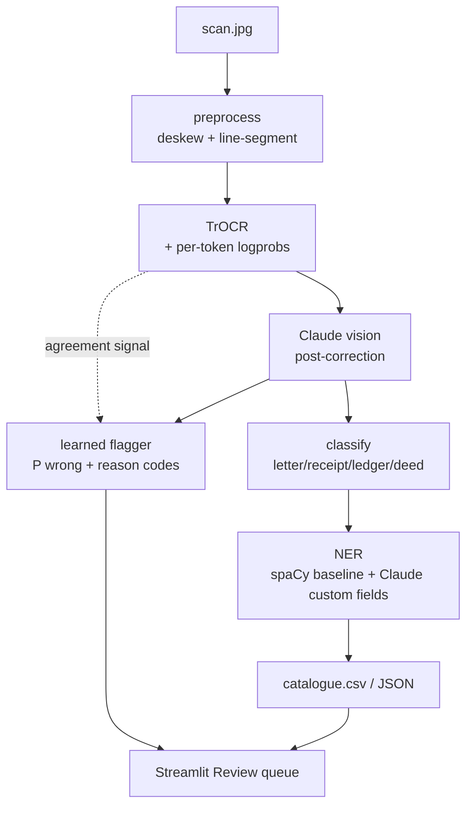

# Historical Document Extractor

End-to-end ingestion of historical handwritten archives into structured, human-reviewable output. Pairs a local OCR model with a frontier vision LLM for post-correction, then uses a learned classifier to flag the lines that *still* need a human after the LLM has had a look.

The same pipeline shape generalizes to anything a fast-moving organization needs to digest reliably from images: archived correspondence, leaked documents, court filings, scanned press releases.

<!-- TODO: link to the longer-form Substack write-up here once published -->
<!-- TODO: replace with the public Hugging Face Space URL once deployed (see docs/DEPLOY.md) -->


> **Live demo**: see [docs/DEPLOY.md](docs/DEPLOY.md) for step-by-step Hugging Face Spaces setup.

## Architecture



Pipeline as text, in case Mermaid doesn't render:

```
scan.jpg
  → preprocess (deskew, line-segment)
  → TrOCR (per-token logprobs)
  → Claude vision post-correction (one call per doc; per-line corrections)
  → learned residual-error flagger (P(line still wrong) + reason codes)
  → classify (letter | receipt | ledger | deed)
  → entity extraction (spaCy + Claude)
  → structured JSON / catalogue.csv
  → Streamlit review UI
```

## Headline result

| OCR | Mean CER ↓ | Perfect-line rate ↑ |
|---|---|---|
| TrOCR raw | 0.239 | 1.7% |
| TrOCR + Claude vision post-correction | **0.214** | **24.1%** |

Mean CER barely moves (~11% relative), but **14× more lines are perfect** after post-correction. The bimodal effect fixes nearly-right lines, sometimes adds noise to severely-wrong ones, is what the flagger is built to triage.

**Flagger on residual errors:**

| Metric | GW (in-dist, n=656) | Hand-labelled holdout (OOD, n=82) | Drift |
|---|---|---|---|
| ROC AUC | 0.72 | **0.84** [95% CI 0.76–0.93] | +0.12 |
| Brier | 0.16 | 0.17 | +0.00 |
| 30%-budget recall | 36% | 41% | +5 pp |
| 30%-budget precision | 0.92 | 0.76 | −16 pp |

OOD validated against a hand-labelled holdout of LoC + personal handwritten pages (different writers, different periods). Discrimination AUC is *higher* on OOD because that holdout includes a cluster of post-correction alignment failures — easy positives for the agreement-signal feature. Precision drops 16pp on OOD because the same agreement signal sometimes flags lines where Claude's rewrite happened to be correct anyway. Calibration (Brier) is essentially unchanged. Full breakdown: [`notebooks/ood_validation.ipynb`](notebooks/ood_validation.ipynb).

## Install

```bash
git clone https://github.com/narayananv10/historical-doc-extractor.git
cd historical-doc-extractor

python -m venv .venv && source .venv/bin/activate
pip install -r requirements.txt
python -m spacy download en_core_web_sm   # use _trf instead if you have ≥16 GB RAM

cp .env.example .env
# Edit .env: set ANTHROPIC_API_KEY (required) and HF_TOKEN (recommended)

# Pre-download the model weights (doctr + TrOCR)
python scripts/setup_models.py
```

`HF_TOKEN` is technically optional. The model downloads work anonymously, but it lifts HuggingFace's rate limits and silences the unauthenticated-requests warning. Create a free read-only token at [huggingface.co/settings/tokens](https://huggingface.co/settings/tokens).

`scripts/setup_models.py` works around a known issue where the doctr library hits an HTTP 308 redirect that `urllib` doesn't follow, silently leaving a 0-byte file in `~/.cache/doctr/models/`. Run it once and you're set.

No system-level dependencies required. Tested on macOS (Apple Silicon) and Linux; runs on CPU/MPS without a GPU.

## Run

```bash
# 1. Pull a curated LoC sample set
python scripts/download_loc.py

# 2. (One-time) cache the IAM-GW pipeline run — produces flagger training data.
#    Requires IAM-HistDB Washington dataset extracted into data/raw/iam_gw/
#    (free academic registration at fki.tic.heia-fr.ch).
python scripts/download_gw_pages.py    # ~4 MB of LoC page scans for visual context
python scripts/cache_iam_gw.py          # ~5-10 min, ~$0.10 in Claude API

# 3. Single-document end-to-end
python -m src.pipeline data/samples/letter1.jpg

# 4. Batch over a folder → catalogue.csv
python -m src.batch data/raw/loc/abraham-lincoln-papers -o catalogue.csv

# 5. Streamlit demo
streamlit run app.py
```

Pass `--no-api` to any pipeline command (`src.pipeline`, `src.batch`, or the Streamlit "Skip Claude API" toggle) to skip post-correction, classification, and Claude entity extraction. spaCy NER still runs. Under `--no-api` every line is force-flagged for review with a `NO_API_VERIFICATION` reason — the transcription is unverified raw TrOCR output and shouldn't be trusted as-is.

## Repo layout

```
src/         pipeline modules (preprocess, ocr, postcorrect, classify, ner, flagger, batch)
scripts/     download_loc, cache_iam_gw, evaluate
notebooks/   flagger.ipynb, calibration.ipynb, errors.ipynb
prompts/v1/  versioned Claude system prompts
models/      flagger_v1.pkl (trained sklearn classifier)
data/        samples/ (checked in), parquet_cache/ (committed flagger data)
app.py       Streamlit demo
docs/        demo GIF + supplemental notes
```

See [tentative_plan.md](tentative_plan.md) for the full architecture and design rationale.

## Responsible AI

This project takes a *fail-loudly* posture: every line that gets emitted carries a probability of error and, when flagged, a human-readable explanation. Specifically:

- **Accuracy:** published CER on the IAM-GW public benchmark; flagger evaluated with ROC, Brier, and a reliability diagram in [`notebooks/calibration.ipynb`](notebooks/calibration.ipynb), then re-validated on a hand-labelled OOD holdout in [`notebooks/ood_validation.ipynb`](notebooks/ood_validation.ipynb) (n=82, 7 docs spanning two writers and two periods).
- **Transparency:** flagger feature importances are published in [`notebooks/flagger.ipynb`](notebooks/flagger.ipynb); entities tagged by source (`spacy` vs `claude`); Claude prompts versioned under [`prompts/v1/`](prompts/v1/).
- **Human oversight:** the Review queue tab surfaces every flagged line with its crop, both the raw and corrected text, the probability, and the reasons.
- **Accountability:** per-line probability and reasons are persisted to `catalogue.csv` so every downstream record can be audited.
- **Honest fallbacks:** under `--no-api`, every line is force-flagged with a `NO_API_VERIFICATION` reason rather than silently producing unverified TrOCR output. The Streamlit Transcription tab also switches to a warning caption in that mode.

## Notebooks

| Notebook | What's in it |
|---|---|
| [`flagger.ipynb`](notebooks/flagger.ipynb) | Feature engineering, GroupKFold training, ROC + AUC + Brier, feature importance plot, model bundle save |
| [`calibration.ipynb`](notebooks/calibration.ipynb) | Reliability diagram, reviewer-budget framing, threshold selection, OOD limitation |
| [`errors.ipynb`](notebooks/errors.ipynb) | Char-level confusion (substitutions / deletions / insertions), three cherry-picked failure cases with the actual handwriting images, four concrete v2 directions |
| [`ood_validation.ipynb`](notebooks/ood_validation.ipynb) | Hand-labelled OOD holdout (n=82); ROC AUC + Brier vs in-dist GW; reliability diagram overlay; reviewer-budget table; failure-mode breakdown by `frac_chars_changed` |
